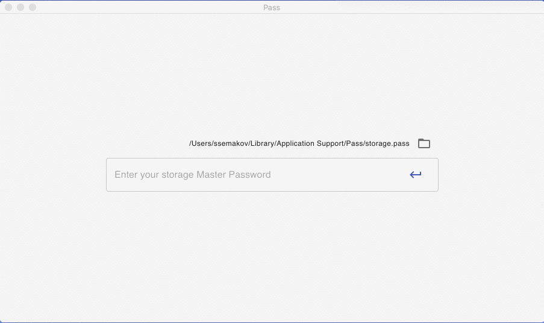

# Pass

Another password manager.



## Binareis

- MacOsX: https://github.com/ssemakov/pass/releases/download/v0.1.0/Pass-0.1.0.dmg
- Linux: https://github.com/ssemakov/pass/releases/download/v0.1.0/pass_0.1.0_amd64.deb

## Getting Started

These instructions will get you a copy of the project up and running on your local machine for development and testing purposes.

### Installing

To install and use Pass on your machine use one of the precompiled binaries availalbe in the releases section.

Instructions bellow are step by step series of examples that tell you how to get a development env running and build Pass from source code.

First, clone the repo via git:

```
git clone https://github.com/ssemakov/pass.git
```

And then install the dependencies with yarn.

```
cd pass
yarn
```

### Starting Development

Start the app in the `dev` environment. This starts the renderer process in hot-module-replacement mode and starts a webpack dev server that sends hot updates to the renderer process:

```
$ yarn dev
```

Pass is based on [electron-react-boilerplate](https://github.com/electron-react-boilerplate/electron-react-boilerplate).

Here you can find `electron-react-boilerplate` [docs and guides](https://electron-react-boilerplate.js.org/docs/installation/)

### Running the unit tests

```
yarn test
```

### Running end to end tests

```
yarn test-e2e
```

### Coding style tests and type checking

lint:

```
yarn lint
```

flow:

```
yarn flow
```

## Built With

- [Electron](https://www.electronjs.org/) - crossplatform framework for building desktop apps with JavaScript, CSS and HTML.
- [React](https://reactjs.org/) - A JavaScript library for building user interfaces
- [Redux](https://redux.js.org/) - State Container for JS Apps
- [Formik](https://jaredpalmer.com/formik) - Form helper for React
- [Material-UI](https://material-ui.com/) - React UI components supporting Material Design
- [electron-react-boilerplate](https://github.com/electron-react-boilerplate/electron-react-boilerplate) - boiler plate

## Versioning

We use [SemVer](http://semver.org/) for versioning. For the versions available, see the [tags on this repository](https://github.com/ssemakov/pass/releases).

## License

This project is licensed under the MIT License - see the [LICENSE](LICENSE) file for details
